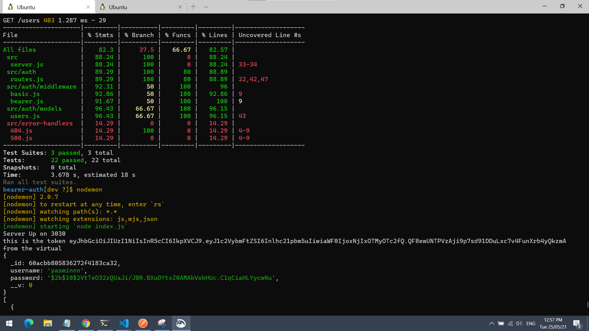
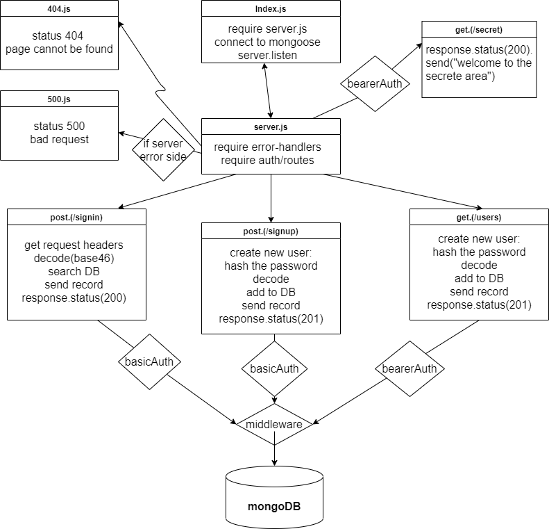

# bearer-auth

## Install
Clone the repository from GitHub
Run the command npm i dotenv express jest supertest mongos morgan @code-fellows/supergoose, base-64, bcrypt to install dependencies
create .env file with PORT variable
## Test
Run the command npm test to test and verify the server and the logger middleware  are working.
Run the command npm run test for testing .

## Test image : 

## Run
Start the server using nodemon/npm start
Visit http://localhost:PORT at the PORT number you've assigned in your .env

## Routes
* https://yasmeen-bearer-auth.herokuapp.com/bad
* https://yasmeen-bearer-auth.herokuapp.com/foo
* https://yasmeen-bearer-auth.herokuapp.com/singin
* https://yasmeen-bearer-auth.herokuapp.com/signup
* https://yasmeen-bearer-auth.herokuapp.com/users
* https://yasmeen-bearer-auth.herokuapp.com/secret

## UML Diagram 

